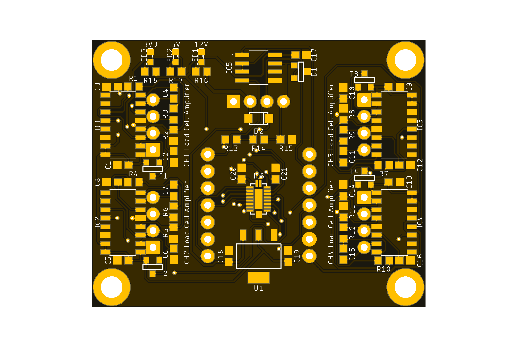
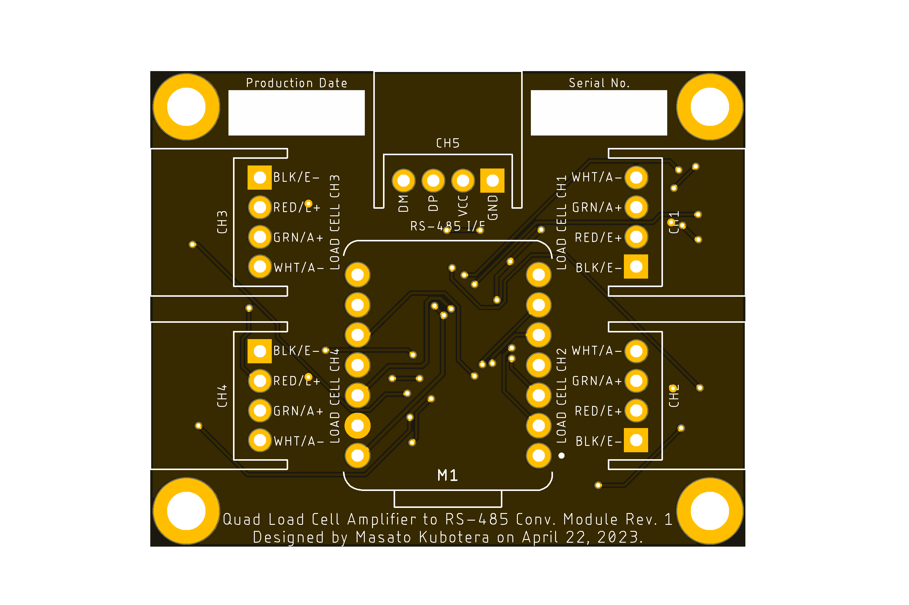

<html lang="en">

<head>
	<meta charset="uft-8">
	<meta name="author" content="Masato Kubotera">
    <meta name="description" content="">
</head>

<body>
    
<strong>This product is currently under development!</strong>

	<h1>Quad Load Cell Amplifier to RS-485 Conv. Module</h1>
        

            This product can connect up to four load cells, and the change in resistance of the load cells can be amplified by an amplifier to 24 bit and sensed by a microcontroller at 80 Hz. This product uses a ready-made microcontroller board, simplifying PCB design and assembly of electronic components. For communication with the microcontroller, in addition to the USB connector on the microcontroller, RS-485 converted from UART  is available. 
            The RS-485 I/F connector has power input of up to 15 V. This allows servo motors with RS-485 I/F to be connected to the same bus as servo motors, etc. 
            The microcontroller that can be attached to this product is the <a href="https://www.seeedstudio.com/XIAO-c-1964.html?">XIAO series</a> manufactured by Seeed Studio. Select a microcontroller from the lineup according to the required performance.
             
             
            This product is developed as a foot load measurement module for SUSTAINA-OPTM and is used, for example, to estimate the position of the robot's center of mass. 
            In SUSTAINA-OPTM, four of the following load cells are connected to this module.
            <ul>
                <li><a href="https://www.alibaba.com/product-detail/SC700-Fishing-Scales-Small-Size-thin_60710601230.html">SC700-40kg (Sensor and Control Co., Ltd.)</a></li>
            </ul>
            The following microcontrollers are attached to this module.
            <ul>
                <li><a href="https://www.seeedstudio.com/Seeeduino-XIAO-Arduino-Microcontroller-SAMD21-Cortex-M0+-p-4426.html?">XIAO SAMD21 (Seeed Studio)</a></li>
            </ul>     
        

	<h2>Features Rev. 1</h2>
        

            <table>
                <tr>
                    <th>Top Surface of PCB</th>
                    <th>Bottom Surface of PCB</th>
                    <th>Assembled Electronic Components</th>
                </tr>
                <tr>
                    <td></td>
                    <td></td>
                    <td></td>
                </tr>
            </table>
        

    <h3>PCB</h3>
        

            <ul>
                <li>50 mm x 40 mm PCB layout</li>
                <li>4 x ø3.2 Mounting Holes</li>
                <li>
                    4 x Load Cell Ports
                    <ul>
                        <li>1" (2.54mm) pitch through-holes for XH connecter(JST)
                            <ul>
                                <li>BLK/E-: Excitation- (E-) or GND</li>
                                <li>RED/E+: Excitation+ (E+) or VCC</li>
                                <li>GRN/A+: Output+, Signal+, or Amplifier+</li>
                                <li>WHT/A-: Output-, Signal-, or Amplifier-</li>
                            </ul>
                        </li>
                    </ul>
                </li>
                <li>
                    1 x RS-485 I/F Port
                    <ul>
                        <li>1" (2.54mm) pitch through-holes for XH connecter(JST)
                            <ul>
                                <li>DM: RS-485 Data Signal Minus</li>
                                <li>DP: RS-485 Data Signal Plus</li>
                                <li>VCC: Power Input (Input voltage: 6.2~15V)</li>
                                <li>GND: Common Ground</li>
                            </ul>
                        </li>
                    </ul>
                </li>
            </ul>
        

    <h3><a href="http://en.aviaic.com/detail/730856.html">AVIA HX711</a></h3>
        

            <ul>
                <li>Two selectable differential input channels</li>
                <li>On-chip active low noise PGA with selectable gain of 32, 64 and 128</li>
                <li>On-chip power supply regulator for load-cell and ADC analog power supply</li>
                <li>On-chip oscillator requiring no external component with optional external crystal</li>
                <li>On-chip power-on-reset</li>
                <li>Simple digital control and serial interface: pin-driven controls, no programming needed</li>
                <li>Selectable 10SPS or 80SPS output data rate</li>
                <li>Simultaneous 50 and 60Hz supply rejection</li>
                <li>Current consumption including on-chip analog power supply regulator: normal operation < 1.5mA, power down < 1uA</li>
                <li>Operation supply voltage range: 2.6 ~ 5.5V</li>
                <li>Operation temperature range: -40 ~ +85C</li>
                <li>16 pin SOP-16 package</li>
            </ul>
        

	<h2>Development Environments</h2>
    

        This product is designed with the following software.
            <ul>
                <li><a href="https://www.autodesk.com/products/eagle/overview">Autodesk Eagle 9.6.2</a></li>
            </ul>
    

    <h2>Repository Contents</h2>
        

            <dl>
                <dt><a href="/images">\images</a></dt>
                <dd>PCB preview images and capture of design screen</dd>
                <dt><a href="/libraries">\libraries</a></dt>
                <dd>Libraries used in Autodesk Eagle design</dd>
                <dt><a href="/documents">\documents</a> </dt>
                <dd>Documentation for making and using this product</dd>
                <dt><a href="/pcb_order">\pcb_order</a> </dt>
                <dd>Gerber data and documentation for ordering PCB</dd>
                <dt><a href="/schematic.pdf">schematic.pdf</a></dt>
                <dd>Circuit diagram of this product</dd>
                <dt>*.brd</dt>
                <dd>Board wiring design file by Autodesk Eagle</dd>
                <dt>*.sch</dt>
                <dd>Circuit diagram design file by Autodesk Eagle</dd>
                <dt><a href="/.gitignore">.gitignore</a></dt>
                <dd>A file that tells Git not to track a particular file</dd>            <dt><a href="/LICENSE">LICENSE</a></dt>
                <dd>License to use this product</dd>
            </dl>
        

    <h2>Documentation</h2>
        

            The following documents are available for this product.
            <ul>
                <li><a href="/pcb_order/README.md">\pcb_order\README.md</a>: Information for ordering the PCB</li>
                <li><a href="/documents/BOM.md">\document\BOM.md</a>: List of electronic components assembled on the PCB</li>
            </ul>
        

    <h2>References</h2>
        

            This product was designed with reference to the following products.
            <ul>
                <li><a href="https://www.sparkfun.com/products/13879">SparkFun Load Cell Amplifier - HX711</a></li>
            </ul>
        

    <h3>Acknowledgements</h3>
        

            The development of this module is based on the following foot load measurement modules in the RoboCup Humanoid League.
            <ul>
                <li><a href="https://github.com/Rhoban/ForceFoot">Rhoban/ForceFoot</a>: Robotic foot design involving force sensors</li>
                <li><a href="https://github.com/bit-bots/bit_foot">bit-bots/bit_foot</a>: Foot pressure sensor for a humanoid robot</li>
            </ul>
            I would like to take this opportunity to thank you.
        

    <h2>Contact</h2>
        

            If you have any questions, please contact the designer of this product, Masato Kubodera, by <a href="mailto:masato.kubotera@sustaina-op.com">e-mail</a>. 
            E-mail: <a href="mailto:masato.kubotera@sustaina-op.com">masato.kubotera@sustaina-op.com</a>
        

    <h2>License Information</h2>
        

            This product is open source. Please review the <a href="/LICENSE">LICENSE</a> for license information. 
             
            This product by Masato Kubotera is licensed under a <a href="http://creativecommons.org/licenses/by-nc-sa/4.0/">Creative Commons Attribution-NonCommercial-ShareAlike 4.0 International License</a>.
        
    
</body>
</html>
